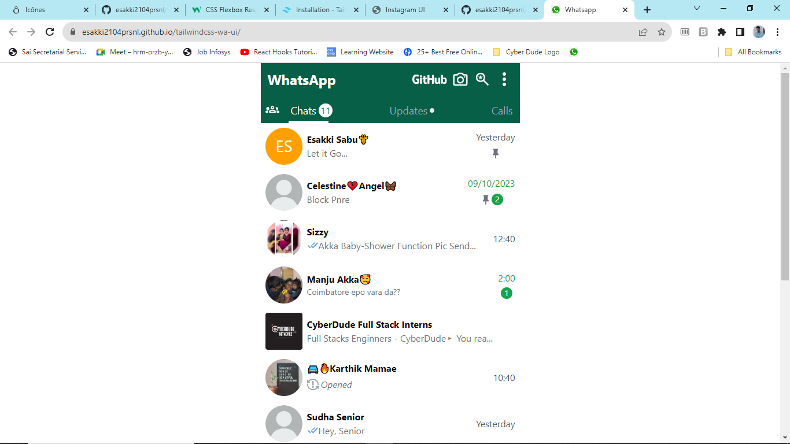

# WhatsApp UI Challenge Tailwind CSS

   ### Preview Imgae

   

## Project Description

This is an intern project for Cyberdude Network aimed at recreating an interactive user interface resembling WhatsApp using Tailwind CSS. The project focuses on providing an engaging and visually appealing UI design while using Tailwind CSS for styling.

## Table of Contents

- [Project Description](#project-description)
- [Table of Contents](#table-of-contents)
- [Features](#features)
- [Demo](#demo)
- [Installation](#installation)
- [Usage](#usage)
- [License](License)

## Features

-  Interactive chat interface
-  Tailwind CSS for responsive design
-  Mock chat conversations
-  Emoji support
-  Attachments and multimedia sharing
-  User-friendly and visually appealing UI

## Demo

You can view a live demo of this project at [🚀Live Demo](https://esakki2104prsnl.github.io/tailwindcss-wa-ui/).

## Installation

To run this project locally, follow these steps:

1. Clone the repository to your local machine:

   ```bash
   git clone https://github.com/esakki2104prsnl/tailwindcss-wa-ui.git

## License
This project is licensed under the [MIT License.](./MIT%20License.md)